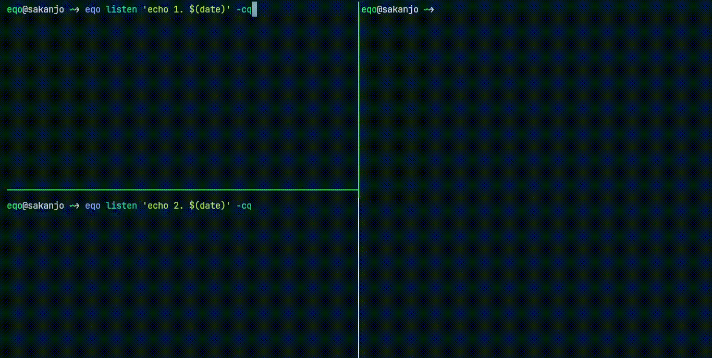

<h1 align="center">🔊 Eqo</h1>

<p align="center">⚡ Listen for triggers and execute actions seamlessly.</p>

<p align="center">
    <a href="https://github.com/sakanjo/eqo/actions"></a>
</p>

> ✨ Help support the maintenance of this package by [sponsoring me](https://github.com/sponsors/sakanjo).

Table of Contents
=================

* [Demo](#-demo)
* [Install](#-install)
* [Usage](#-usage)
* [Support the development](#-support-the-development)
* [Credits](#%EF%B8%8F-credits)
* [License](#-license)

## 🎬 Demo



## 📦 Install

```bash
cargo install eqo
```

Or you can download it from the [releases page](https://github.com/sakanjo/eqo/releases).

## 🦄 Usage

Run the server in the background, or as a service

```bash
eqo server -q
```

Start listening

```bash
eqo listen 'date'
```

Trigger the command

```bash
eqo run
eqo run
# ...
```

## 💖 Support the development

**Do you like this project? Support it by donating**

Click the ["💖 Sponsor"](https://github.com/sponsors/sakanjo) at the top of this repo.

## ©️ Credits

- [Salah Kanjo](https://github.com/sakanjo)
- [All Contributors](../../contributors)

## 📄 License

[MIT License](https://github.com/sakanjo/eqo/blob/master/LICENSE) © 2023-PRESENT [Salah Kanjo](https://github.com/sakanjo)
